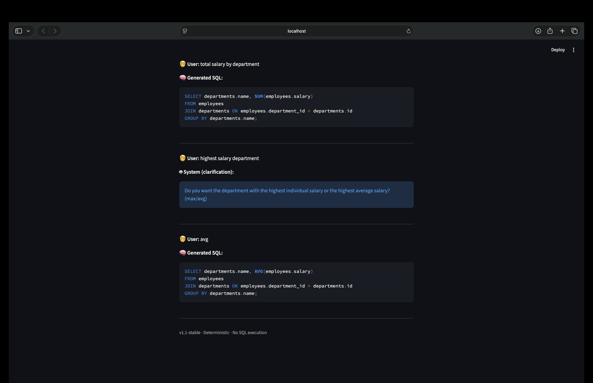

# nl2sqlp — Advanced Natural Language to SQL Engine

> **A hybrid Natural Language Processing system that translates English queries into executable SQL. Powered by a custom-hosted Language Model and an intelligent Clarification Engine.**

## 🚀 Project Overview

**nl2sqlp** bridges the gap between non-technical users and complex databases. Instead of requiring users to master SQL syntax, this system allows them to ask questions in plain English. 

Unlike standard API wrappers, this project implements a **custom, locally-hosted Language Model** to understand schema semantics. Crucially, it features a robust **Classification & Clarification Module** that detects ambiguity in user requests, ensuring high accuracy by engaging the user in a dialogue rather than guessing.

## 📸 Demo in Action

*The system handling an ambiguous query ("highest salary department") by pausing execution to ask for clarification, rather than hallucinating an answer.*



## 🌟 Key Technical Highlights

### 1. Intelligent Classification & Disambiguation
**This is the critical differentiator of the system.** Pure generation models often "hallucinate" when a user's request is vague.
* **The Problem:** As seen in the screenshot above, if a user asks *"highest salary department,"* do they mean the department with the *single highest earner* or the *highest average salary*?
* **The Solution:** The `clarifier.py` module acts as a classification layer. It analyzes the `LogicalForm` for missing intents. If ambiguity is detected, it triggers a **Clarification Protocol**, pausing generation to ask the user for the specific intent.
* **The Result:** This ensures the user *always* reaches the correct answer, significantly reducing SQL errors and providing a reliable UX.

### 2. Custom Language Model (`universal_nl2sql_lm`)
The core engine is not a generic API call. I have integrated **specialized, local Language Model assets**:
* **Privacy-First:** All processing happens locally; no sensitive schema data is sent to external APIs.
* **Domain Specificity:** The LM and tokenizer are optimized to map natural language tokens specifically to database schema entities (tables, columns) and SQL keywords.
* **Architecture:** The system uses `lm_adapter.py` to bridge the raw model weights with the application logic, allowing for easy model swaps or fine-tuning updates.
## 📊 Why nl2sqlp is Better Than Other Models

Most text-to-SQL solutions rely on large, generic "Black Box" LLMs. Here is how my hybrid architectural approach compares:

| Feature | Generic LLM (GPT-4/LLaMA) | nl2sqlp (My Model) |
| :--- | :--- | :--- |
| **Ambiguity Handling** | Guesses the intent (leads to wrong data) | **Asks for Clarification** (Ensures accuracy) |
| **Data Privacy** | Sends schema/data to 3rd party APIs | **100% Local** (Custom-hosted LM) |
| **Schema Strictness** | May hallucinate non-existent columns | **Schema-Driven** (Strict mapping via `schema.json`) |
| **Explainability** | Hard to debug "why" it wrote a query | **Transparent Pipeline** (LogicalForm is inspectable) |
| **Compute Cost** | Expensive API tokens per request | **One-time local setup** with zero per-query cost |
## ⚙️ Dynamic Schema Adaptation

One of the most powerful features of this engine is its **agnostic design**. You can adapt this tool to any industry (Healthcare, Finance, Retail) simply by updating the schema definition.

* **Zero Code Re-writes:** You do not need to change the LM or the Generator logic to support a new database.
* **How to Update:** Simply modify the `schema.json` file (and `schema_utils.py` if adding custom types).
* **Automatic Mapping:** The `planner.py` dynamically inspects the schema at runtime. If you add a new table for "Inventory" or "Sales," the system immediately begins recognizing those entities in natural language queries.
## 🏗️ System Architecture

The pipeline follows a modular design, separating intent understanding (LM) from logic construction (Planner).

### The Application Layer
* **`app.py`**: A **Streamlit** web interface (seen in the screenshot). It maintains conversation history and handles clarifications via the core orchestrator.
* **`main.py`**: The Orchestrator. It manages the lifecycle of a query, handles the `pending_intent` state machine during clarifications, and provides a CLI fallback.

### The Intelligence Layer
* **`universal_nl2sql_lm/`**: Local model and tokenizer assets (safetensors/tokenizer).
* **`planner.py`**: The semantic parser. It builds a `LogicalForm` from tokens and `schema.json`, applying heuristics for tables, columns, and filters.
* **`clarifier.py`**: Encapsulates clarification detection and message generation for ambiguous intents.
* **`sql_generator.py`**: The final compiler that turns the populated `LogicalForm` into valid SQL strings.

## 📂 File Structure Breakdown

| File | Description |
| :--- | :--- |
| `app.py` | Streamlit frontend for chat-based SQL generation. |
| `main.py` | Backend entry point; runs the pipeline and implements the clarification protocol. |
| `universal_nl2sql_lm/` | **Custom LM assets** (model weights and tokenizer). |
| `lm_adapter.py` | Adapter pattern to interface with the custom LM. |
| `clarifier.py` | Logic for detecting ambiguity and generating clarification questions. |
| `planner.py` | Heuristic planner that builds the `LogicalForm`. |
| `logical_form.py` | Definition of the mutable object carrying query state (tables, cols, filters). |
| `normaliser.py` | Pre-processing pipeline to standardize raw text input. |
| `encoder.py` | Tokenization logic for mapping text to tokens used by the planner. |
| `sql_generator.py` | Deterministic SQL transpiler. |
| `schema.json` | The canonical database definition (Tables, Columns, Types). |

## ⚡ Quickstart

### Prerequisites
- Python 3.8+
- [Optional] CUDA-enabled GPU for faster LM inference.

Install Streamlit if you want the UI, then run:

```bash
pip install streamlit
streamlit run app.py
```

Or use the CLI REPL to iterate faster:

```bash
python main.py
# then enter natural language queries like: "highest salary department"
```

## Important conventions

- Clarification protocol: `main.py` sets `pending_intent` to a `LogicalForm` when a clarification is required. The next user response is applied to `pending_intent` and then cleared.
- Logical forms are mutated in-place (attributes such as `group_by`, `aggregation`, `join_required`). Follow existing attribute names when changing planner or generator code.
- Schema-driven planning: `planner.py` inspects `schema.json` for table/column matches; update schema and planner together if the data model changes.
- The UI intentionally does not execute generated SQL — it only displays it (see `app.py` footer). Do not add automatic DB execution without explicit safety checks.

## Where to look first when modifying behavior

- Intent recognition & heuristics: `planner.py` and `normaliser.py`.
- Clarification rules: `clarifier.py` and `main.py` (`pending_intent` handling).
- SQL emission: `sql_generator.py`.


# Created by Krish Nayyar.
